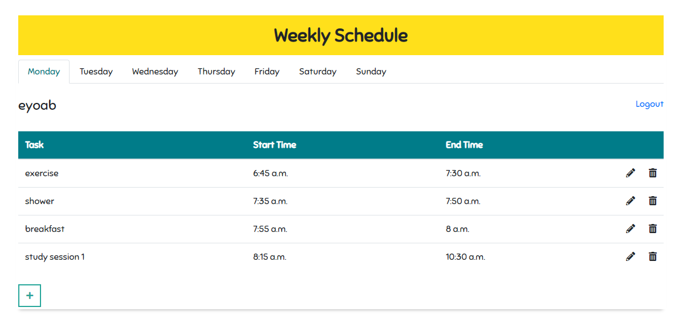

# weekly-task-scheduler

A weekly task scheduling app built using Django in the backend, and HTML, CSS, Bootstrap, JavaScript, JQuery in the frontend.

It allows logged in users to perform crud operations on tasks.

It uses AJAX (Asynchronous JavaScript and XML) to make requests to the database.

Ajax is a technique for loading data (from the server) into part of a page without having to refresh the entire page. Thus making the website more dynamic.

 

   

